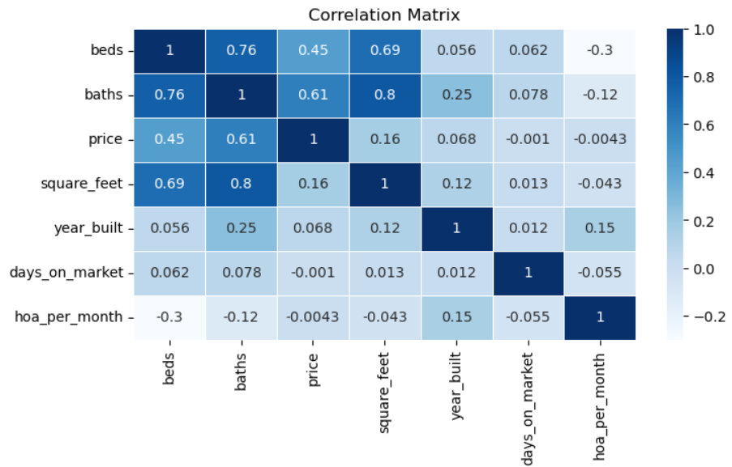
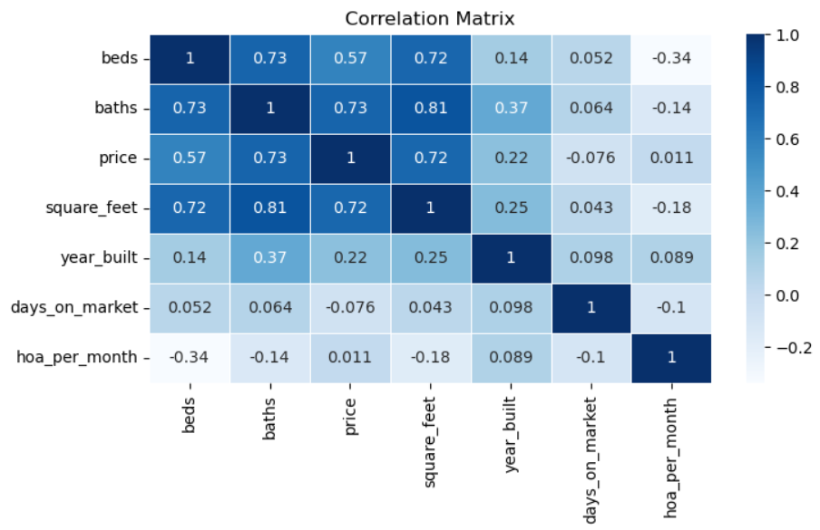
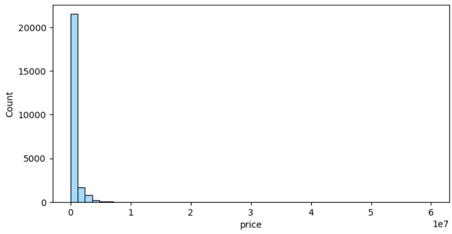
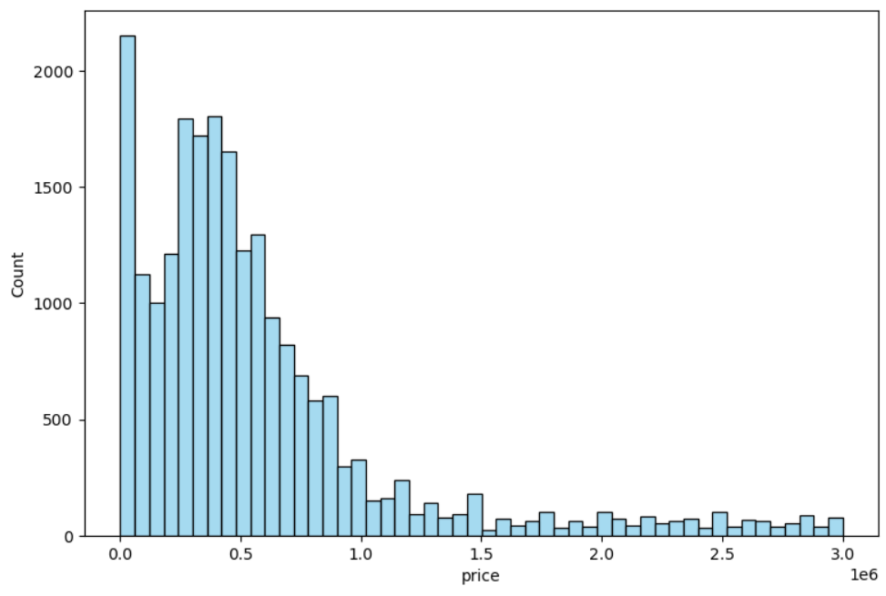
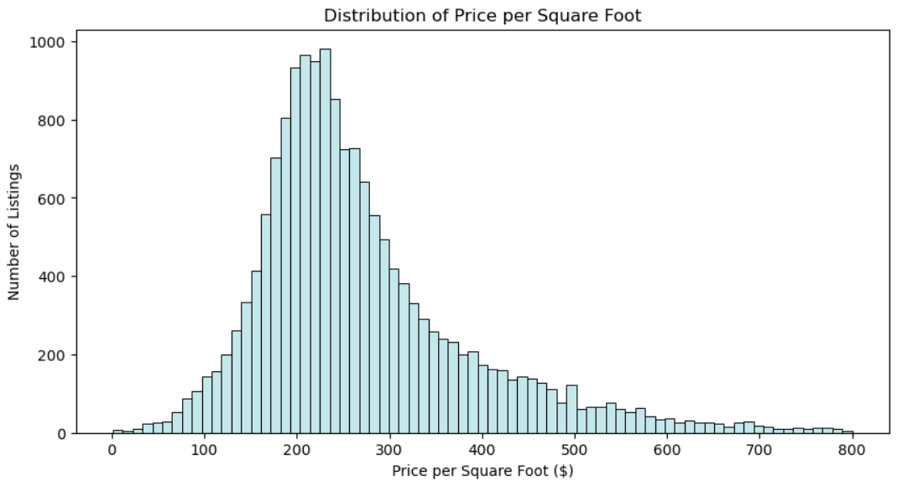
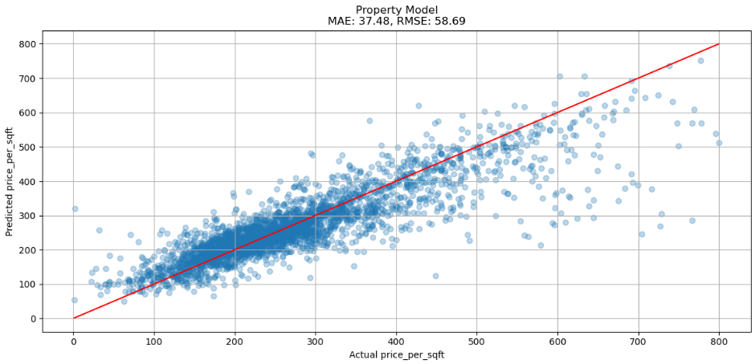

# Virginia Housing Market Analysis & Prediction

[](https://vahousing-price-predictor.streamlit.app/)

**An end-to-end pipeline for collecting, cleaning, analyzing, and modeling Virginia's housing market.**

Sourced from Redfin, this project identifies high-value and cost-efficient housing options and predicts home prices from standard property features (square footage, beds, baths, lot size). It's built with everyday homebuyers in mind: outliers are handled deliberately so predictions reflect realistic market conditions for typical residential buyers, not luxury or edge-case listings.

*(The live demo may take ~10 seconds to wake up if it's been idle.)*

---

## Overview

- Automated scraping of Redfin listings across every Virginia city.
- Cleaning and structuring raw data with SQL.
- In-depth EDA to guide modeling decisions.
- A regression model identifying high-value housing based on price per square foot.
- A model predicting Virginia housing prices from user-supplied property details.
- A Streamlit app that puts the price predictor in front of anyone, with no setup.

## Tech Stack

- **App:** Python, Streamlit
- **Modeling:** scikit-learn (Random Forest Regressor)
- **Data Collection:** `requests`, Redfin's internal API + sitemap XML (originally Selenium/BeautifulSoup)
- **Data Cleaning:** MySQL
- **Analysis:** pandas, NumPy, Matplotlib, Seaborn

## Data Pipeline

### 1. Scraping (`scraping/`)

**Step 1: Extracting Virginia city IDs (`xml_city_ids.py`):** parses Redfin's sitemap XML to dynamically pull every Virginia city ID, name, and URL, instead of hardcoding a city list. This keeps the scraper scalable to any state.

**Step 2: Scraping listings by city (`housing_scrape.py`):** queries Redfin's internal search API per city (`region_type=6`), paginating with `start`/`max_per_page=100` to pull every listing. Extracts address, price, beds, baths, square footage, lot size (converted from sq ft to acres), year built, days on market, and property type, streaming output to CSV in chunks for memory efficiency.

The scraper originally used Selenium + BeautifulSoup, but switching to `requests` against Redfin's sitemap-based city IDs and internal API cut total runtime from ~2 hours to under 10 minutes (~92% faster), and makes the approach scalable to the entire US.

### 2. Cleaning (`cleaning/`)

Raw scraped data was imported into MySQL and cleaned:
- Removed duplicates and invalid entries (missing address/price).
- Standardized property type labels (e.g. "Single Family Residential" → "Single Family").
- Converted beds/baths/price/square footage from text to numeric types.
- Trimmed whitespace and newline characters from URLs for clean exports.

Because of the future-proofing done during scraping, this stage was straightforward; most of the real feature engineering was saved for the modeling notebook.

### 3. Exploratory Data Analysis (`exploratory_data_analysis/housing_data_eda.ipynb`)

- Dropped the unused `id` column; replaced 0-value placeholders in `beds`/`baths`/`square_feet` with `NaN` (MySQL had coerced nulls to 0).
- Built correlation heatmaps before/after cleaning to guide feature selection.
- Identified and removed outliers via top-5 extreme values, distribution plots, and 99/99.5/99.9th-percentile quantile analysis: homes with extreme days-on-market, high-HOA outliers, pre-1940 builds, prices above $3M, and beds/baths beyond the 99.9th percentile.

<table>
  <tr>
    <td align="center"><br><em>Before cleaning</em></td>
    <td align="center"><br><em>After cleaning</em></td>
  </tr>
</table>
<table>
  <tr>
    <td align="center"><br><em>Before cleaning</em></td>
    <td align="center"><br><em>After cleaning</em></td>
  </tr>
</table>

**Key findings:** square footage has the strongest positive correlation with price; HOA fees show essentially zero correlation with price; homes with more privacy (ranches, single-family) command a higher price/sqft than condos, multi-family, or townhouses.

<div align="center"></div>

### 4. Modeling (`modeling/ml_modeling.ipynb`)

- Focused on predicting `price_per_sqft`, split into separate land and property dataframes (land listings have very different outlier profiles: high acreage, missing square footage, long time on market).
- Encoded cities by average price/sqft to improve location representation; this single change improved prediction power by **+50%**.
- Trained a Random Forest Regressor: averages across many trees reduce overfitting, dampen outlier impact, and handle non-linear relationships well.

<div align="center"></div>

## Key Results

- Initial property model: **±$180** MAE predicting price per square foot (mean-price baseline).
- After city encoding + log transformation: error reduced to **±$37.52** — a **~79% total reduction**.
- City/location encoding alone accounted for ~50% of the error reduction; log-transforming skewed features cut it a further 20–30%.
- Most influential features: square footage, number of baths, city-encoded price, and property type.

## Project Structure

```
housing_project/
├── scraping/
│   ├── xml_city_ids.py           # Extracts Virginia city IDs from Redfin's sitemap
│   ├── housing_scrape.py         # Scrapes listings per city
│   └── all_corrected_listings.csv
├── cleaning/
│   ├── housing_clean.sql         # MySQL cleaning script
│   └── cleaned_housing_data.csv
├── exploratory_data_analysis/
│   └── housing_data_eda.ipynb
├── modeling/
│   ├── ml_modeling.ipynb
│   └── housing_modeling_data.csv
├── price_predictor/
│   ├── price_predictor.py        # Streamlit app (entry point)
│   ├── model_price.pbz2          # Trained, compressed model
│   └── city_mapping.pbz2         # City → encoded price mapping
├── images/                       # EDA & model result charts
└── requirements.txt
```

## Run Locally

```bash
git clone https://github.com/willmizer/va_housing_analysis.git
cd va_housing_analysis
python -m venv venv
source venv/bin/activate        # Windows: venv\Scripts\activate
pip install -r requirements.txt
streamlit run price_predictor/price_predictor.py
```

Run from the repo root: `price_predictor.py` loads its model files with paths relative to the project root.

## Limitations

- Data scraped from Redfin at a point in time — the Virginia housing market changes rapidly; predictions reflect market conditions at scrape time, not current prices.
- Outliers were deliberately removed (homes above $3M, pre-1940 builds, extreme HOA outliers) so the model is not suited for luxury, historic, or otherwise atypical properties.
- Virginia only — the model's city encodings and price distributions do not generalize to other states.
- No time-series component — the model does not capture seasonal price patterns, interest rate changes, or year-over-year appreciation trends.
- City encoding uses average price/sqft from the training data; newly incorporated areas or cities with few listings may be poorly represented or mapped to the overall mean.

## Future Improvements

- Integrate external datasets (school ratings, crime stats, walk scores).
- Scale scraping and modeling to the entire US, not just Virginia.
- Build a user interface with more real-time filtering.

## License

This project is shared for portfolio and educational purposes. Feel free to explore the code, but please reach out before reusing it commercially.

© 2026 Will Mizer
