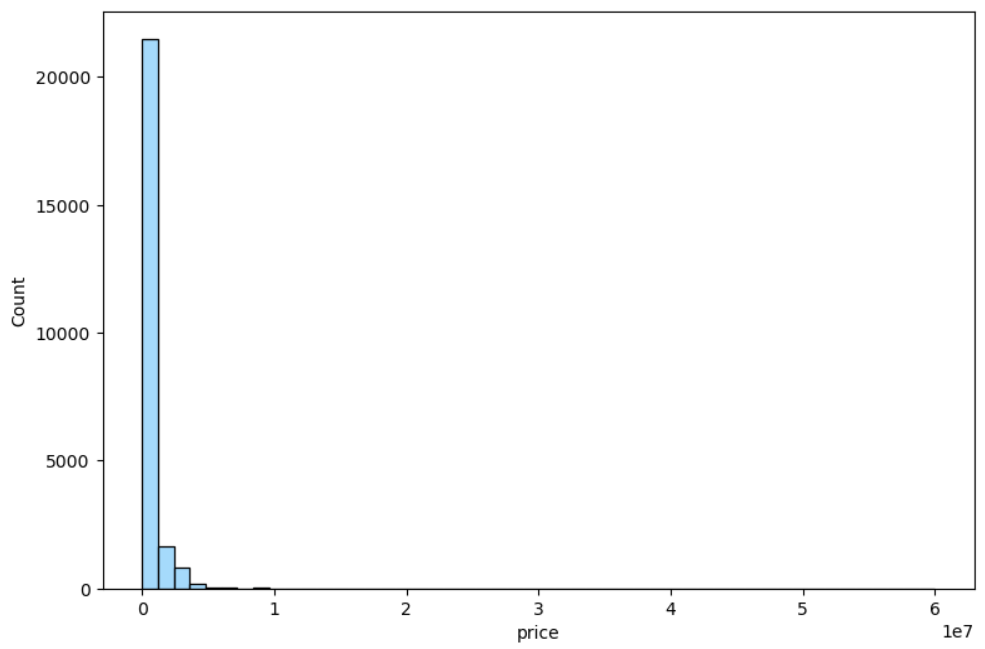
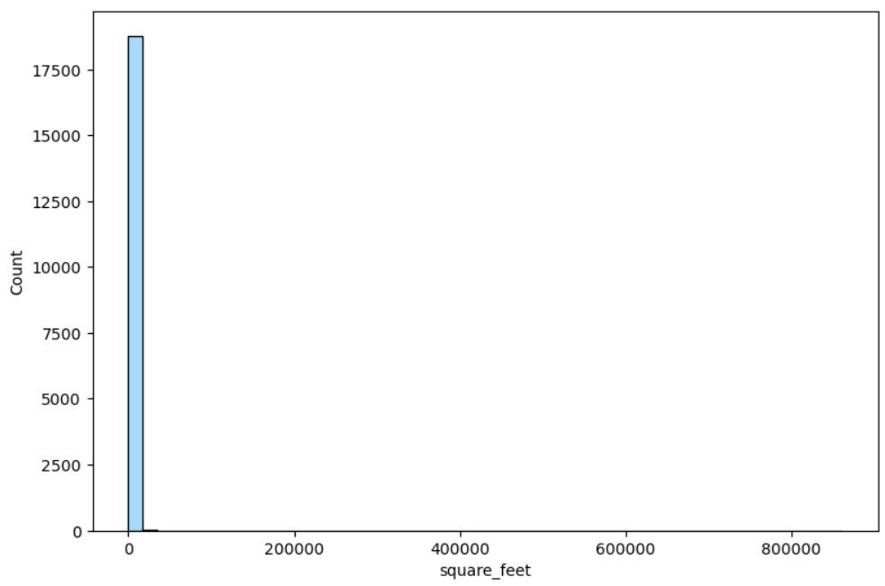

# **Virginia Housing Market Analysis & Prediction**

This project delivers a end-to-end pipeline for collecting, cleaning, analyzing, and modeling housing data across Virginia, sourced from Redfin. The objective is to build a system that identifies high-value and cost-efficient housing options tailored to user preferences, while accurately predicting home prices based on key property features such as square footage, bedrooms, bathrooms, and lot size. Designed with everyday homebuyers in mind, the model emphasizes practical usability—adjusting for outliers and refining predictions to better reflect realistic market conditions for typical residential buyers.

## Code Files Included

| File                        | Description                                                                                     |
| --------------------------- | ----------------------------------------------------------------------------------------------- |
| `housing_scrape.py`         | Scrapes housing listings from Redfin using city IDs. Saves full listing data to CSV.            |
| `xml_city_ids.py`           | Extracts and parses city IDs from Redfin’s XML sitemap for use in scraping.                     |
| `updated_housing_clean.sql` | SQL script for cleaning the scraped data before analysis.                                       |
| `housing_data_eda.ipynb`    | Jupyter notebook that performs exploratory data analysis on cleaned housing data.               |
| `ml_modeling.ipynb`         | Preps , builds and evaluates a Random Forest regression model to predict price per square foot. |

## Table of Contents

1. [Project Overview](#project-overview)  
2. [Workflow Summary](#workflow-summary)  
3. [Prediction Approach](#prediction-approach)  
4. [Key Results](#key-results)  
5. [Future Improvements](#future-improvements)

## Project Overview

In this project I combined the power of web scraping, SQL cleaning, exploratory data analysis, and machine learning to try and predict patterns in Virginia housing listings and generate recommendations with value-based predictions. As the housing market grows more and more unpredictable, a tool to predict available houses with good value, and pricing info will allow users identify high-value properties and make more informed decisions when navigating Virginia's real estate landscape.

It includes:

- Automated scraping of Redfin listings 
- Cleaning and structuring raw data using SQL
- In-depth EDA to help guide modeling decisions
- A regression model to identify high-value housing options based on price per square foot
- A model to predict VA housing pricing given standard user housing information (beds, baths, sqft, acres etc.)
- A Streamlit GUI that allows users to easily and effortlessly predict housing prices

## Workflow Summary

### Part 1: Web Scraping Virginia Housing Listings 
The first stage of the project was focused on collecting housing data from Redfin by automating a two-step scraping workflow:

**Step 1: Extracting Unique Virginia City IDs (xml_city_ids.py)**
- To dynamically target every city with housing data in Virginia, I scraped the Redfin sitemap XML:

**Why**: This avoids hardcoding city names and ensures scalability across all current listings(this can be scaled to all cities in USA for example).

I parsed the XML sitemap to extract:

- The Redfin city ID (needed for API queries)

- City names for logging

- Corresponding URLs

**`unique_city_ids` Ex output**: 

| city_name     | city_id | url                                                       |
| ------------- | ------- | ---------------------------------------------------------- |
| Abbs Valley   | 37317   | https://www.redfin.com/city/37317/VA/Abbs-Valley          |
| Abingdon      | 22      | https://www.redfin.com/city/22/VA/Abingdon                |
| Accomac       | 28      | https://www.redfin.com/city/28/VA/Accomac                 |
| Aden          | 29022   | https://www.redfin.com/city/29022/VA/Aden                 |
| Adwolf        | 21132   | https://www.redfin.com/city/21132/VA/Adwolf               |

**Part 2: Scraping Listing Data by City (housing_scrape.py)**
Using the city ID list, I queired RedFins main site to collect detailed housing listings:

- Queried each city using city_id and region_type=6 (Redfin's code for city search).

- Paginated results using start and max_per_page=100 to retrieve all data available per city.

Key fields extracted included:

- Address, city, price, beds, baths, square footage, lot size (converted to acres), year built, and property type.

- The RedFin website only provides lot size in square feet on their listings page, but acreage is more intuitive when dealing with land analysis.

Data handling considerations:

- Fallbacks for missing fields ("N/A" defaults) to keep consistency

- CSV output streamed in chunks for memory efficiency (all_corrected_listings.csv)

**`all_corrected_listings` Ex output**:

| address               | city        | price   | acres | days_on_market | property_type           | url                                                                                   |
|-----------------------|-------------|---------|--------|----------------|--------------------------|----------------------------------------------------------------------------------------|
| 000 James St          | Bluefield   | 31500   | 1.36   | 41             | Vacant Land              | https://www.redfin.com/VA/Bluefield/James-St-24605/home/188951533                    |
| 0 Tyler St            | Abbs Valley | 25000   | N/A    | 41             | Vacant Land              | https://www.redfin.com/VA/Abbs-Valley/Tyler-St-24605/home/195316922                  |
| 19510 Wynscape Dr     | Abingdon    | 470000  | 0.45   | 7              | Single Family Residential| https://www.redfin.com/VA/Abingdon/19510-Wynscape-Dr-24210/home/133101574            |
| 16319 Mary St         | Abingdon    | 285000  | 0.53   | 4              | Single Family Residential| https://www.redfin.com/VA/Abingdon/16319-Mary-St-24210/home/133134572                |
| 15497 Porterfield Hwy | Abingdon    | 459900  | 1.07   | 4              | Single Family Residential| https://www.redfin.com/VA/Abingdon/15497-Porterfield-Hwy-24210/home/133033950        |

### **Scraping Overview**
The initial version of the scraper used Selenium and BeautifulSoup to navigate and extract listing data, but due to high latency and page load times, I transitioned to using requests with Redfin’s sitemap-based XML city IDs and their internal API. This optimization reduced total runtime from nearly 2 hours to under 10 minutes(saving approximately 92% of scraping time) for collecting data across all Virginia cities. This speed up of scraping time allows the program to become more scalable so in the future I can scale to the entire USA or multiple states etc.

## **[Scraping directory](https://github.com/willmizer/va_housing_analysis/tree/main/scraping)**

### **MySQL Data Cleaning**

After scraping, I used SQL to clean and standardize the raw housing data before analysis. This included:

- Importing the CSV data into a MySQL table.

- Removing duplicates and invalid entries (listings with missing addresses or prices).

- Standardizing inconsistent property type labels (converting "Single Family Residential" to "Single Family" for simplicity).

- Converting all relevant fields (beds, baths, price, square footage) from text to int or double values for proper analysis.

- Trimming whitespace and cleaning up newline characters in URLs to ensure clean exports.

`cleaned_housing_data.csv` output Ex:
| id | address               | city        | beds | baths | price  | square_feet | acres | year_built | days_on_market | property_type | hoa_per_month | url                                                                                   |
|----|------------------------|-------------|------|-------|--------|-------------|--------|-------------|----------------|----------------|----------------|----------------------------------------------------------------------------------------|
| 1  | Tbd Lake Lndg          | Abingdon    | 0.0  | 0.0   | 299000 | 0           | 1.58   | 0           | 46             | Land           | 29             | https://www.redfin.com/VA/Unknown/Tbd-Lake-Lndg-24211/home/185413800                 |
| 2  | 000 James St           | Bluefield   | 0.0  | 0.0   | 31500  | 0           | 1.36   | 0           | 41             | Land           | 0              | https://www.redfin.com/VA/Bluefield/James-St-24605/home/188951533                    |
| 3  | Tbd Bridgeview Dr      | Abingdon    | 0.0  | 0.0   | 70000  | 0           | 0.5    | 0           | 354            | Land           | 0              | https://www.redfin.com/VA/Unknown/Tbd-Bridgeview-Dr-24211/home/190996715             |
| 4  | 0 Tyler St             | Abbs Valley | 0.0  | 0.0   | 25000  | 0           | 0.0    | 0           | 41             | Land           | 0              | https://www.redfin.com/VA/Abbs-Valley/Tyler-St-24605/home/195316922                  |
| 5  | 19510 Wynscape Dr      | Abingdon    | 3.0  | 2.5   | 470000 | 2216        | 0.45   | 2006        | 7              | Single Family  | 0              | https://www.redfin.com/VA/Abingdon/19510-Wynscape-Dr-24210/home/133101574            |

Datatypes and column descriptions:
| Column           | Data Type     | Description                                      |
|------------------|---------------|--------------------------------------------------|
| `id`             | INT           | Primary key                                      |
| `address`        | VARCHAR(255)  | Property street address                          |
| `city`           | VARCHAR(100)  | City where the property is located               |
| `beds`           | DOUBLE        | Number of bedrooms                               |
| `baths`          | DOUBLE        | Number of bathrooms                              |
| `price`          | INT           | Listing price in USD                             |
| `status`         | VARCHAR(50)   | Listing status (Active, Pending)                 |
| `square_feet`    | INT           | Square footage of the home                       |
| `acres`          | DOUBLE        | Lot size in acres (converted from sq ft)         |
| `year_built`     | INT           | Year the home was built                          |
| `days_on_market` | INT           | Days the property has been on the market         |
| `property_type`  | VARCHAR(100)  | Type of property (Single Family, Land etc.)      |
| `hoa_per_month`  | INT           | Monthly HOA fee (0 if no HOA fee)                |
| `url`            | VARCHAR(1000) | Direct Redfin listing URL                        |

### **Cleaning Overview**

The MySQL preprocessing was relativly simple because of the future proofing I did in the scraping. A lot of the data was already very clean making the cleaning process go by more smoothly. Modeling prep cleaning and feature development were saved for the jupyter ntoebook files.

## **[Cleaning directory](https://github.com/willmizer/va_housing_analysis/tree/main/cleaning)**

### 3. Exploratory Data Analysis (Python [pandas,numpy,seaborn and matplotlib])

Part 1: Initial Dataset Overview
Loaded the cleaned housing dataset (cleaned_housing_data.csv) and use .info/.describe to understand what the data looked like up to this point.

Dropped the id column (not useful for my case).

Replaced all 0 values in numeric columns (beds, baths, square_feet) with NaN to properly reflect missing data (moving from MySQL transformed all null values into 0's).

2. Correlation Matrix
Created a correlation heatmap for key numeric variables (before and after to see impact of cleaning):

- Helped identify relationships, e.g., strong positive correlation between beds, baths, and square_feet.

- Used for feature selection in modeling.

<table>
  <tr>
    <td align="center">
      
       <em>Before cleaning</em>
    </td>
    <td align="center">
      
       <em>After cleaning</em>
    </td>
  </tr>
</table>

3. Outlier Detection & Visualization
For each numeric field (price, beds, square_feet, etc.):

- Displayed the top 5 extreme values.

- Plotted initial distribution charts using histograms and boxplots.

- Identified one-sided distributions across all numeric features indicating outliers.

4. Quantile Analysis
- Calculated 99%, 99.5%, and 99.9% quantiles to check outlier thresholds per field.(this was another step to ensure I am choosing appropriate outliers)

- Informed decisions on cutoffs for cleaning extreme values.

5. Targeted Cleaning for Skewed Data
- Removed homes with extremely high days_on_market unless they were listed as Land.

- Dropped specific high-HOA outlier rows.

- Filtered out homes built before 1940 to remove unusually old listings, which often introduce data noise.

- Set price maximum to 3 million dollars - this is to keep our typical home buyer in mind and to increase prediction power of model later on.

- Capped the number of beds and baths at the 99.9th percentile to exclude extreme outliers from skewing the analysis.

- Remove square footage outliers to ensure it doesnt affect future feature modeling.

Visualization examples:

<table>
  <tr>
    <td align="center">
      
       <em>Before cleaning</em>
    </td>
    <td align="center">
      
       <em>After cleaning</em>
    </td>
  </tr>
</table>

<table>
  <tr>
    <td align="center">
      
       <em>Before cleaning</em>
    </td>
    <td align="center">
      
       <em>After cleaning</em>
    </td>
  </tr>
</table>

## **[Exploratory Data Analysis directory](https://github.com/willmizer/va_housing_analysis/tree/main/exploratory_data_analysis)**

### 4. Machine Learning Modeling(Python [Random Forest Regressor and scikit-learn])

- Focused on predicting `price_per_sqft` for residential properties
- Applied log transformation to normalize the target
- Encoded cities based on average price/sqft to improve location representation
- Trained a Random Forest Regressor using engineered features

## Prediction Approach

A prediction function was developed that:

- Accepts user-defined preferences (beds, baths, square footage, acreage)
- Ranks and filters listings to show top value-matching options

This enables the system to recommend homes that deliver strong value relative to their size, type, and location.

## Key Results

- Initial model had a ±$180 error in predicting price per square foot.
- After city encoding and log transformation, error was reduced to ±$37.52.
- Most influential features: square footage, number of baths, city-encoded price, and property type.
- Modeling `price_per_sqft` helped normalize across property sizes and improve model interpretability.

## Future Improvements

- Add a secondary model to predict total home price directly (using `log(price)`).
- Integrate external datasets (e.g., school ratings, crime stats, walk scores).
- Build a user interface to allow real-time filtering and comparison.
- Build a price predicting function for users trying to sell or see house value

